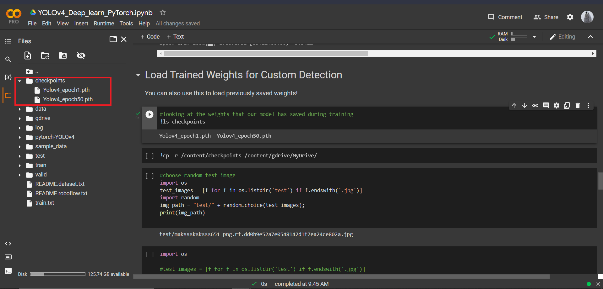
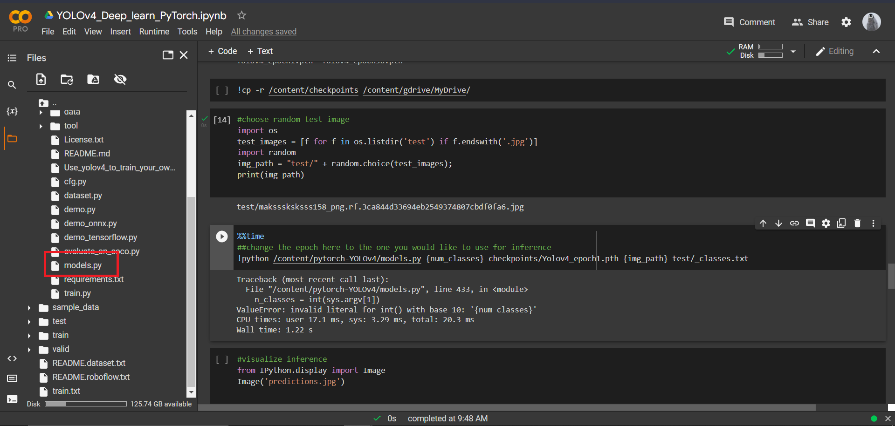
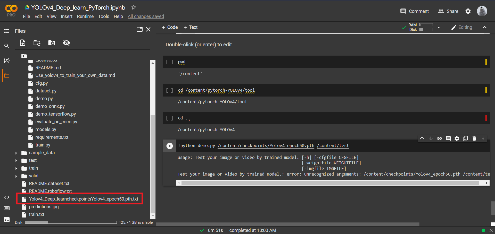
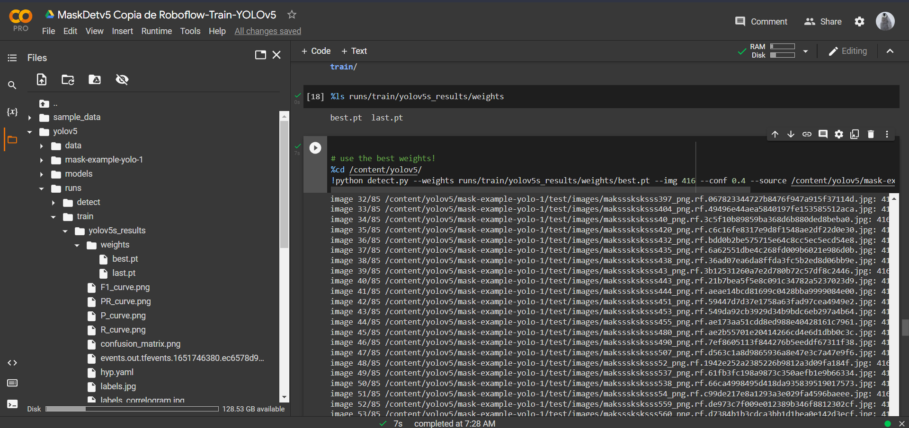
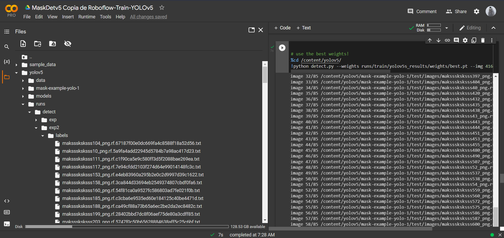
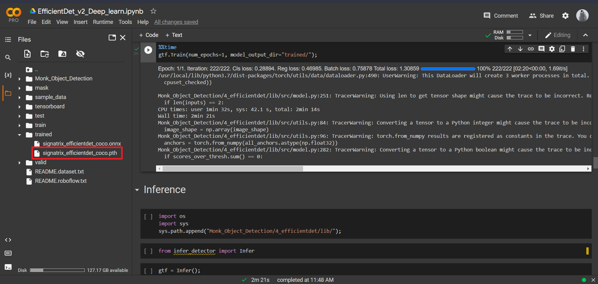
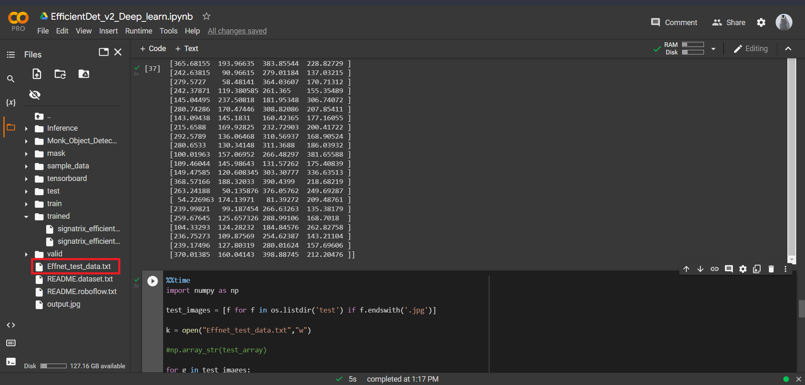

We compare the face mask detection performance for three models:
- YOLOv4
- YOLOv5
- EfficientDet

## Setup YOLOv4 for mask detection.

The jupyter notebook provided for each model has a link to upload the custom mask images dataset from Roboflow-AI. Hence, a zip file of the dataset is provided only for reference in the Data_set directory.

To setup the Yolo-v4 model, open the YOLOv4 jupyter notebook present in the Models directory in Google Colab.

Run all the code cell till the "Train Custom Detector" code cell. This will install all the necessary dependencies, fetch the Yolo V4 model which is intended to be fine-tuned for mask detection and create the necessary directories and sub-directories within the root (/content) directory.

Train the model for 1 epoch by running the "Train Custom Detector" code cell. This will create a new Directory by the name of Checkpoints. Upload the pretrained weights for 50 epchos using the drive link to downlad the weights, into this directory as illustrated below:

After this, locate the models.py file in the pytorch-YOLOv4 directory, and replace it with models.py directory provided in the Models folder along with Yolov4's Jupyter notebook.

After which run the remaining code cells.

The replaced models.py file has an appended function which writes the co-ordinates of the predicted bounded boxes, prediction confidence and classification for each test image in a text file named "Yolov4_Deep_learningcheckpointsYolov4_epoch50.pth.txt.""

The newly made "Yolov4_Deep_learningcheckpointsYolov4_epoch50.pth.txt." files contains the inference data for the test dataset.

To measure the performance of the Yolov4 model,the metrics selected are: IoU, precision, recall and inference time. 
Average inference time is provided by the model, with testing dataset inference.

To get the IoU scores, precision and recall, use the code in the jupyter notebook "Yolov4_a.ipynb" provided in the YOLOv4 subdirectory, within the Inference directory. Note that the accompanying .txt files for the ground truth annotations and the model predicted bounding boxes annotations.

## Setup YOLOv5 for mask detection.

To setup the Yolo-v5 model, open the YOLOv5 jupyter notebook present in the Models directory in Google Colab.

Run all the code blocks upto and including "Train custom YOLOV5 Detector" block.

After which replace the best.py file with the one provided in weights folder under YOLOV5, in the runs subdirectory in yolov5 directory. As illustrated below. This will replace the weights trained for 1 epoch, with weights trained for 50 epochs.

After this is done run the remaining code cells. This will lead to the creation of a directory with predicted annotation of each test image in a .txt file format. As seen below

For getting associated performance metrics. The annotations associated with each image in each of the .txt file created is needed to be appended to a single text file. For this download all of the annotation text files and then use the "YOLOv5_annotation_lister.ipynb" jupyter notebook provided under the YOLOv5 sub-directory of the Inference directory. Note that all the individual annotation text and the "YOLOv5_annotation_lister.ipynb" are required to be provided appropriate file path and locations.

After this run the "BB_Annotation_correction_YOLOv5" Jupyter notebook file to rearrange  the annotations in the same format as the ground-truth annotations.

Finally, run the "Yolov5_a.ipynb" to get the IoU scores, precision and recall metrics for the model.

## Setup EfficientDet for mask detection.

To setup the EfficientDet model, open the "EfficientDet_v2_Deep_learn.ipynb" jupyter notebook present in the Models directory under EffecientDet in Google Colab.

Run all the code until Inference code cells. (Not including Inference). This will train the model till 1 epoch and create a new directory named "trained". 

In trained directory replace the "signatrix_efficientdet_coco.pth" file with one provided in the weights folder of this repository under EfficientDet.

After this run the remaining code cells.

This will create a new file named "Effnet_test_data.txt" which contains the predicted bounding boxes (annotations) by the model.

Download this file. To get the performance metrics of the model from this file, use the code in the "EffDet_a.ipynb" jupyter notebook in the Inference section under the EffecientDet directory of this repository.

Credits: RoboflowAI : roboflow.com